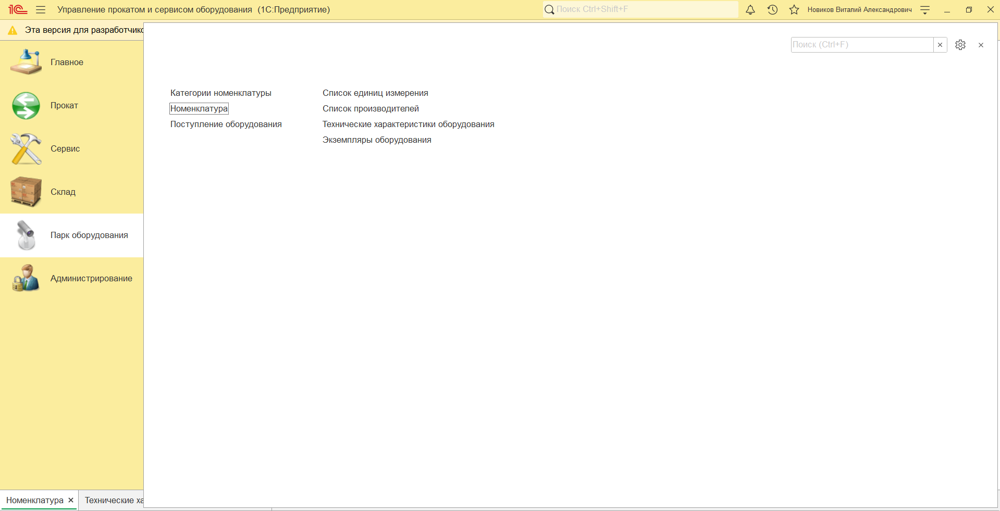
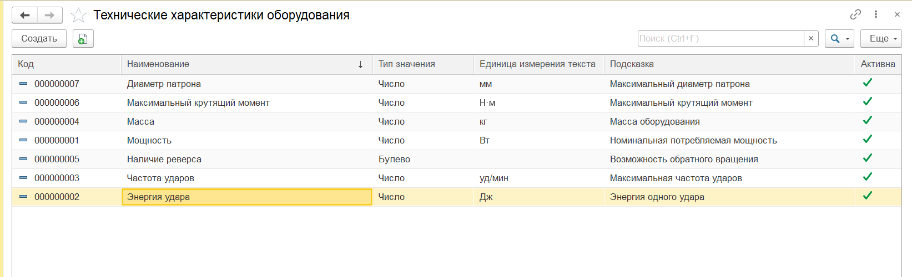
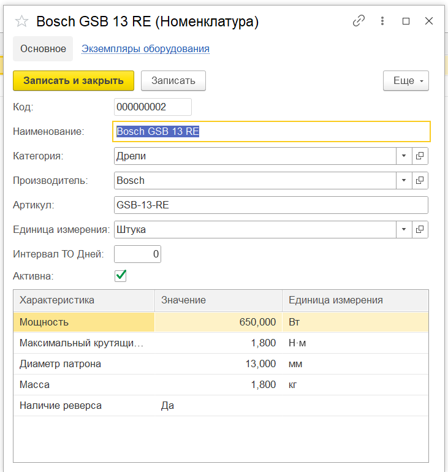

# 1C-Rental

Конфигурация на платформе **1С:Предприятие 8.3** для управления прокатом и сервисным обслуживанием оборудования.

Учебно-портфельный проект, разрабатываемый для прохождения полного цикла создания прикладного решения: от анализа предметной области и проектирования архитектуры до реализации бизнес-логики, тестирования и дальнейшего развития системы.

> Проект находится в активной разработке.

## Предметная область

Система предназначена для компании, которая:

- закупает оборудование;
- ведёт учёт отдельных экземпляров оборудования;
- сдаёт оборудование клиентам в аренду;
- принимает оборудование после аренды;
- контролирует местонахождение и состояние каждого экземпляра;
- выполняет техническое обслуживание и ремонт;
- учитывает материалы и запасные части;
- контролирует доступность оборудования для бронирования и аренды.

## Архитектура

В основе модели лежит разделение **моделей оборудования** и их **физических экземпляров**.

Модель описывает вид оборудования и его технические характеристики, а каждый физический экземпляр учитывается отдельно и имеет собственный инвентарный номер. Это позволяет независимо отслеживать местонахождение, состояние, аренду и обслуживание каждого экземпляра.

Для реализации бизнес-процессов спроектированы справочники, документы, регистры сведений и накопления, план видов характеристик, а также отчёты.

В конфигурацию внедрена **Библиотека стандартных подсистем (БСП) 3.1.11.392**.

## Реализовано

### Базовая архитектура

- спроектированы основные бизнес-сценарии и архитектура конфигурации;
- создана основная структура справочников и документов;
- созданы регистры сведений и накопления;
- подготовлены каркасы отчётов;
- внедрена и настроена БСП;
- исходный код конфигурации хранится в Git.

### Технические характеристики оборудования

Реализован механизм произвольных технических характеристик моделей оборудования на базе **плана видов характеристик**:

- характеристики имеют собственные типы значений;
- для категорий оборудования задаётся состав доступных и обязательных характеристик;
- значения характеристик моделей хранятся в регистре сведений;
- характеристики отображаются и редактируются непосредственно в форме модели;
- контролируется заполнение обязательных и допустимых характеристик;
- предусмотрен контроль изменения категории модели и типов используемых характеристик;
- реализован серверный поиск моделей по нескольким характеристикам одним запросом.

### Пользователи и значения по умолчанию

- подключена и настроена подсистема БСП «Пользователи»;
- справочник сотрудников связан с пользователями информационной базы;
- реализовано определение текущего сотрудника по пользователю БСП;
- централизовано получение текущего сотрудника и основного склада;
- для справочников и документов настроены необходимые значения по умолчанию;
- в документах автоматически заполняются ответственный, исполнитель и склад в соответствии с бизнес-логикой.

## Скриншоты

### Интерфейс подсистемы «Парк оборудования»

### Технические характеристики оборудования

### Карточка модели оборудования

Технические характеристики модели формируются в зависимости от выбранной категории оборудования.

## В разработке

Следующие этапы:

- проведение документов и формирование движений;
- контроль складских остатков;
- учёт состояния и местонахождения экземпляров оборудования;
- ценообразование;
- бронирование с контролем доступности и пересечения интервалов;
- выдача и возврат оборудования;
- сервисное обслуживание и ремонт;
- печатные формы;
- отчёты на СКД;
- роли и права доступа;
- интеграция с внешним веб-приложением по HTTP/JSON.

## Планируемая интеграция

Планируется разработать небольшой веб-интерфейс для демонстрации взаимодействия внешней системы с 1С.

Через него предполагается получать информацию о доступном оборудовании и выполнять отдельные операции бронирования. Обмен данными с 1С планируется реализовать по HTTP/JSON.

## Технологии

- 1С:Предприятие 8.3.27;
- встроенный язык 1С;
- управляемое приложение;
- Библиотека стандартных подсистем 3.1.11.392;
- запросы 1С;
- регистры сведений и накопления;
- план видов характеристик;
- Git / GitHub.
